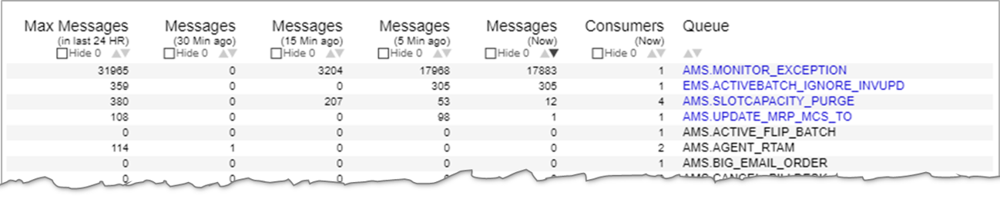
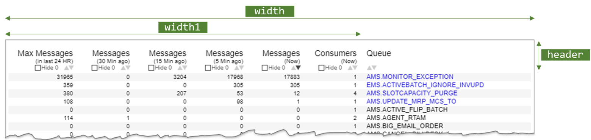
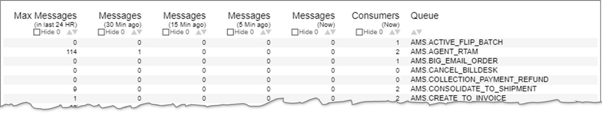

# <span style="color: red;">This tutorial is WIP</span>


# Creating a Table visualization using Vega
This tutorial will walk you through creating a table visualization using Vega. The table would have:
- Banded rows
- Sorting capability on columns
- Filtering capability (hiding zero quantity rows)

*This assumes that the reader has basic understanding of how Vega works.*

**Here is how the visualization looks like:**



[View source](./source/1_final_source.json)


# Background and the requirement
We have a set of systems that pass on messages through MQ. When a system doesn't behave per expectations, often the system admin would want to know what is happening with the MQ messages. So, we monitor the MQ every minute, and send the Queue Depth (Number of messages in the queue) and the Number of Consumers on each queue to Elasticsearch. That data is used to build this visualization.

The requirement is:
* To show :
  1. the number of messages in each queue at the following points in time:
    - Now
    - 5 Minutes ago
    - 15 Minutes ago
    - 30 Minutes ago
  2. the maximum number of messages that each queue had in last 24 hours
  3. the number of consumers on each queue
* Be able to sort the data
* Be able to filter out the rows with zero messages
* Highlight the queues that currently have messages

# Data for the tutorial
In the real visualization, data is pulled from Elasticsearch. There are two `datasets` that are pulled from Elasticsearch:

`mqdata-last-30-min-sorted` - This contains the number of messages and number of consumers for each queue slieced at the desired time buckets. This is achived with a `range query` on Elasticsearch.

```json
"query": {
  "bool": {
    "should": [
      {"range": {"SysTime": {"gte": "now-70s",   "lte": "now",       "_name": "Now"}}},
      {"range": {"SysTime": {"gte": "now-370s",  "lte": "now-300s",  "_name": "5MinBack"}}},
      {"range": {"SysTime": {"gte": "now-970s",  "lte": "now-900s",  "_name": "15MinBack"}}},
      {"range": {"SysTime": {"gte": "now-1870s", "lte": "now-1800s", "_name": "30MinBack"}}}
    ]
  }
}
```


`maxdepth-24H` - This contains the maximum of messages for each queue in last 24 hours. This is achived by running an `aggregation` on Elasticsearch.

```json
"aggs": {
  "queues": {
    "terms": {"field": "FQQN.keyword", "size": 150},
    "aggs": {
      "MaxDepth": {"max": {"field": "Depth"}}
    }
  }
}
"query": {
  "range": {"SysTime": {"gte": "now-1d/m", "lte": "now/m"}}
}
"size": 0

```

For this tutorial, I have taken one snapshot each for both these data sets and uploaded those two jsons to gist. 


# Definining Constants
This visualization needs a bunch of constants to control the layout, colors etc. These are defined as `signals`. 

While most of these are self-explanatory, we will elaborate on some that may not be obvious.

`header` - This constant defines the space reserved for table header on the top (See the diagram below)

`width1` - Total width allocated for all the numeric colums (See the diagram below)

Explanation: You will notice that the column layout is such that all the columns have same width except the Queue column which needs to be much wider. Due to this non-uniformity, we cannot use a `band` scale to get the x position for each column. Thus, we will simply allocate some width (which we will call as "width1") for the first set of columns. (Later on, we will refer to these set of columns as "columnSet1"). Another option we could have used is to simply hardcode the width (and hence the x value) of each column.



For the checkboxes (the "Hide 0" checkboxes under column heading), we are going to use a `mark` of type `symbol` instead of using the standard checkbox (`"bind": {"input": "checkbox"}`). This is so that we can get complete control on the placement of the checkboxes on the screen. Even though `symbol` provides only most typical shapes (circle, triangle etc), it does allow you to define a custom `shape` using `SVG Path` (Refer to [this link](https://vega.github.io/vega/docs/marks/symbol/)). So, we create the "unchecked" and "checked" checkboxes using SVG Paths and specify those paths using the below signals:

`shapeMarkUnchecked` - SVG Path for square without check mark<br>
`shapeMarkChecked` - SVG Path for square with check mark

> You can use [this link](https://developer.mozilla.org/en-US/docs/Web/SVG/Tutorial/Paths) to learn more about `SVG Path`.

The rest of constant signals are self explanatory.

# Displaying header 
## Datasets
We could simply use hardcoded `text` marks and display header information. But we will construct it with a static dataset. This not only helps us make the header data manageable, but will also help us in interactive (sort and filter) parts later.

First we define a dataset that describes the header data. In fact, we will use two datasets instead of one to separate numeric columns that have the same width from the much wider Queue column.

```json
  "data": [
    {
      "name": "columnSet1",
      "values": [
        {"columnKey": "MaxDepth", "headerLine1": "Max Messages", "headerLine2": "(in last 24 HR)"},
        {"columnKey": "Depth30Min", "headerLine1": "Messages", "headerLine2": "(30 Min ago)"},
        {"columnKey": "Depth15Min", "headerLine1": "Messages", "headerLine2": "(15 Min ago)"},
        {"columnKey": "Depth5Min", "headerLine1": "Messages", "headerLine2": "(5 Min ago)"},
        {"columnKey": "DepthNow", "headerLine1": "Messages", "headerLine2": "(Now)"},
        {"columnKey": "Consumers", "headerLine1": "Consumers", "headerLine2": "(Now)"}
      ]
    },
    {
      "name": "columnSet2",
      "values": [
        {"columnKey": "FQQN", "headerLine1": "Queue", "headerLine2": ""}
      ]
    }
  ]
```

## Scales
Then we define two scales that would control x position of the columns.

```json
  "scales": [
    {
      "name": "xscaleSet1", "type": "band",
      "domain": {"data": "columnSet1", "field": "columnKey"},
      "range": [10, {"signal": "width1-10"}]
    },
    {
      "name": "xscaleSet2", "type": "band",
      "domain": {"data": "columnSet2", "field": "columnKey"},
      "range": [{"signal": "width1"}, {"signal": "width-10"}]
    }
  ]
```
The `xscaleSet1` would divide the space between `10` and `width1-10` in uniform bands for every datum in dataset `columnSet1`. This will give us equally spaced columns in columnSet1.

`columnSet2` has only one datum and we don't really need `xscaleSet2`, but we have created it just to keep things consistent.


## Marks
We first create a `group` mark over `columnSet1` and display all the lines and symbols of the header for that set of columns. Then we do the same for `columnSet2`.


[Here](./source/2_header_source.json) is our code so far ... and below is what the visualization looks like with that code. Though the sort and filter controls are present, they are, obviously, not active yet.


# Adding the rows
## Prepare the data
We have two datasets, one showing the #messages and #consumers at various time intervals, and the other showing the maximum number of messages in last 24 hours. We need to manipulate these to get a flat row structure. The datasets are defined as:
```json
    {
      "name": "mqdata-last-30-min-sorted",
      "url": "https://gist.githubusercontent.com/paragdeuskar/2ba94d610054ec6d222b6157d4adc96b/raw/acd9f3ce184232592ab64ce20255f27fe91f25f7/mq_depth_gist_data_30min.json",
      "format": {"property": "hits.hits"},
      "transform": [
        {"type": "formula", "as": "SysTime", "expr": "timeParse(datum._source.SysTime, '%Y-%m-%dT%H:%M:%S%Z')"},
        {"type": "formula", "as": "when", "expr": "datum.matched_queries[0]"},
        {
          "type": "project",
          "fields": ["SysTime", "_source.Queue", "_source.Consumers", "_source.Depth", "_source.System", "_source.FQQN", "when"],
          "as": ["SysTime", "Queue", "Consumers", "Depth", "System", "FQQN", "when"]
        },
        {
          "type": "collect", "sort": {"field": ["FQQN", "SysTime"]}
        }
      ]
    },
    {
      "name": "maxdepth-24H",
      "url": "https://gist.githubusercontent.com/paragdeuskar/7279d1532efd9d7be9c4fb3d052312ca/raw/16bc0649dbbb93eb193b328c541153c3ee02368b/mq_depth_gist_data_maxdepth.json",
      "format": {"property": "aggregations.queues.buckets"},
      "transform": [
        {"type": "project", "fields": ["key", "MaxDepth.value"], "as": ["FQQN", "MaxDepth"] },
        {"type": "formula", "as": "Queue", "expr": "substring(datum.FQQN,4)"},
        {"type": "formula", "as": "System", "expr": "substring(datum.FQQN,0,3)"},
        {"type": "collect", "sort": {"field": "FQQN"}}
      ]
    }
```

Our first challenge is that the dataset `mqdata-last-30-min-sorted` itself is not flat. It has 4 rows/data for each queue, each corresponding to a different time. We need to flatten this to get all one datum for each queue.

> In Vega 3.2 or above, there is a `pivot` transform available for this purpose. But for me, Vega 3.2 was not available, hence I had do it in a more laborious way.

First we will create 4 separate datasets from `mqdata-last-30-min-sorted`, each one corresponding to a different time by using `filter` transform. Then we will join these along with the `maxdepth-24H` dataset, using `lookup` transform, to get a flat structure.

For example, the first of the 4 datasets is shown below:
```json
    {
      "name": "depth-now", "source": "mqdata-last-30-min-sorted",
      "transform": [
        {"type": "filter", "expr": "datum.when === 'Now'"}
      ]
    }
```
This filter itself could have been sufficient, but there is one challenge ... you would notice that the MQ is monitored every minute (through cron). Now, based on how quickly MQ responds, how quickly the script forms REST requests and how quickly the data is finally entered into elastic, the lastest reading in elastic might be within the last minute (i.e. 60 seconds) or it may be slightly earlier than that. That's why, the range query on the elasticsearch looks for records with SysTime `"gte": "now-70s"` and `"lte": "now"`. But this creates another problem, that is, there may be two data points that may qualify this range query. If that is the case, our `depth-now` dataset would also have two records for some (or all) queues. Thus, we need to apply a `window` transform to get the `last_value`. With that, our dataset becomes as follows:
```json
    {
      "name": "depth-now", "source": "mqdata-last-30-min-sorted",
      "transform": [
        {"type": "filter", "expr": "datum.when === 'Now'"},
        {
          "type": "window",
          "sort": {"field": "FQQN"},
          "ops": ["last_value", "last_value"],
          "fields": ["Depth", "SysTime"],
          "as": ["Depth", "SysTimeLast"]
        },
        {"type": "filter", "expr": "datum.SysTime === datum.SysTimeLast"}
      ]
    }
```
In a similar fashion, we define datasets `depth-5min-ago`, `depth-15min-ago` and `depth-30min-ago`.

That done, we create a new dataset that summarizes all the data into one flat structure:
```json
    {
      "name": "summarized-data", "source": "maxdepth-24H",
      "transform": [
        {"type": "lookup", "from": "depth-now", "key": "FQQN", "fields": ["FQQN"], "values": ["Depth","Consumers"], "as": ["DepthNow","Consumers"]},
        {"type": "lookup", "from": "depth-5min-ago", "key": "FQQN", "fields": ["FQQN"], "values": ["Depth"], "as": ["Depth5Min"]},
        {"type": "lookup", "from": "depth-15min-ago", "key": "FQQN", "fields": ["FQQN"], "values": ["Depth"], "as": ["Depth15Min"]},
        {"type": "lookup", "from": "depth-30min-ago", "key": "FQQN", "fields": ["FQQN"], "values": ["Depth"], "as": ["Depth30Min"]},
      ]
    }
```

We want banded rows for ease of viewing the table. So, we add a row number to the data and then another field to indicate whether it is an odd or even row. We do this with additional transforms on the dataset:

```json
    {
      "name": "summarized-data", "source": "maxdepth-24H",
      "transform": [
        {"type": "lookup", "from": "depth-now", "key": "FQQN", "fields": ["FQQN"], "values": ["Depth","Consumers"], "as": ["DepthNow","Consumers"]},
        {"type": "lookup", "from": "depth-5min-ago", "key": "FQQN", "fields": ["FQQN"], "values": ["Depth"], "as": ["Depth5Min"]},
        {"type": "lookup", "from": "depth-15min-ago", "key": "FQQN", "fields": ["FQQN"], "values": ["Depth"], "as": ["Depth15Min"]},
        {"type": "lookup", "from": "depth-30min-ago", "key": "FQQN", "fields": ["FQQN"], "values": ["Depth"], "as": ["Depth30Min"]},
        {
          "type": "window", "sort": {"field": ["sortField", "FQQN"], "order": [{"signal": "signalSortOrder"}, "ascending"]},
          "ops": ["row_number"], "as": ["RowNum"]
        },
        {"type": "formula", "as": "Odd", "expr": "datum.RowNum % 2 ? true : false"}
      ]
    }
```
Now we have the data ready and can move on to the business of displaying it.
## Signals
First we add two signals to find the number of rows in the data and to set the height of the visualization:
```json
    {"name": "numRows", "update": "length(data('summarized-data'))"},
    {"name": "height", "update": "rowHeight * numRows + header"},
```
## Scale
We define a band scale:
```json
    {
      "name": "yscale", "type": "band",
      "domain": {"data": "summarized-data", "field": "RowNum", "sort": true},
      "range": [{"signal": "header"}, {"signal": "height"}]
    }
```
This would create uniform bands for rows below the header space.
## Marks
We will create a `group` mark on `summarized-data`. Within that, we will first use a `rect` mark to create visual bands for the rows. Then we will add the data for numeric columns and then the Queue name. The code for this would look like:
```json
    {
      "type": "group",
      "from": {"data": "summarized-data"},
      "marks": [
        {
          "type": "rect",
          "encode": {
            "enter": {
              "height": {"scale": "yscale", "band": 1},
              "fillOpacity": {"value": 1}
            },
            "update": {
              "x": {"value": 0},
              "x2": {"signal": "width-10"},
              "y": {"scale": "yscale", "field": {"parent": "RowNum"}, "offset": -1},
              "fill": [
                {"test": "parent.Odd", "signal": "colorOddRow"},
                {"signal": "colorEvenRow"}
              ]
            }
          }
        },
        {
          "type": "text",
          "from": {"data": "columnSet1"},
          "encode": {
            "enter": {
              "dy": {"signal": "dyRows"},
              "align": {"signal": "alignColumnSet1"},
              "fill": {"value": "#000"},
              "font": {"value": "Helvetica"},
              "fontSize": {"value": 10}
            },
            "update": {
              "x": {"scale": "xscaleSet1", "field": "columnKey", "offset": {"signal": "offsetColumnSet1"}},
              "y": {"scale": "yscale", "field": {"parent": "RowNum"}},
              "text": {"field": {"parent": {"datum": "columnKey"}}}
            }
          }
        },
        {
          "type": "text",
          "from": {"data": "columnSet2"},
          "encode": {
            "enter": {
              "dy": {"signal": "dyRows"},
              "align": {"signal": "alignColumnSet2"},
              "font": {"value": "Helvetica"},
              "fontSize": {"signal": "fontSizeRows"}
            },
            "update": {
              "x": {"scale": "xscaleSet2", "field": "columnKey", "offset": {"signal": "offsetColumnSet2"}},
              "y": {"scale": "yscale", "field": {"parent": "RowNum"}},
              "text": {"field": {"parent": {"datum": "columnKey"}}},
              "fill": [
                {"test": "parent.DepthNow > 0", "signal": "colorNonEmptyQueue"},
                {"signal": "colorEmptyQueue"}
              ]
            }
          }
        }

```

[Here](./source/3_rows_added.json) is our code so far ... and below is what the visualization looks like with that code. 



# Adding sorting capability
Adding the sorting capability would involve 3 things:
1. Identify which sorting button is clicked by the user
2. Sort the data accordingly
3. Highlight the correct sorting button 

## Identify which sorting button is clicked by the user
Let's add the below signals to capture the column and type of sorting (ascending or descending) requested by the user:
```json
    {
      "name": "signalSortColumn", "value": "DepthNow",
      "on": [
        {"events": "@triangleUpSet1:mousedown", "update": "group().datum.columnKey"},
        {"events": "@triangleDownSet1:mousedown", "update": "group().datum.columnKey"},
        {"events": "@triangleUpSet2:mousedown", "update": "group().datum.columnKey"},
        {"events": "@triangleDownSet2:mousedown", "update": "group().datum.columnKey"}
      ],
      "comment": "Indicates the column the user has clicked for sorting"
    },
    {
      "name": "signalSortOrder", "value": "descending",
      "on": [
        {"events": "@triangleUpSet1:mousedown", "update": "'ascending'"},
        {"events": "@triangleDownSet1:mousedown", "update": "'descending'"},
        {"events": "@triangleUpSet2:mousedown", "update": "'ascending'"},
        {"events": "@triangleDownSet2:mousedown", "update": "'descending'"}
      ],
      "comment": "Indicates whether the user wants ascending or descending sorting"
    }
```
There might be a few things worth commenting about these signal definitions ...
* They are done on named marks (such as triangleUpSet1) (Notice that while drawing the visualization, these marks were named accordingly).
* The marks did not have a data source of their own, but were drawn based on `group` data source. Hence, you will see that the `update` statement uses `group().datum.colunmKey` construct.
* `comment` field that is added is not part of the Vega specification, but is added just for easy explanation. Vega ignores this field (with a warning).
* The default sorting is on "DepthNow", in a "descending" fashion.

Now, we have successfully identified the sorting button clicked by the user.

## Sort the data
Now we need to sort the dataset `summarized-data` on the appropriate column. Unfortunately, we cannot use a transform with dynamic column name. So, we add a field to this dataset which will be our designated field to be used for sorting - in fact, we would call it `sortField`. We would ensure to copy the data from appropriate column to `sortField`. To do this we will use `formula` transform on `summarized-data` as follows:
```json
        {"type": "formula", "as": "sortField", "expr": "signalSortColumn === 'FQQN' ? datum.FQQN : datum.sortField"},
        {"type": "formula", "as": "sortField", "expr": "signalSortColumn === 'MaxDepth' ? datum.MaxDepth : datum.sortField"},
        {"type": "formula", "as": "sortField", "expr": "signalSortColumn === 'Depth30Min' ? datum.Depth30Min : datum.sortField"},
        {"type": "formula", "as": "sortField", "expr": "signalSortColumn === 'Depth15Min' ? datum.Depth15Min : datum.sortField"},
        {"type": "formula", "as": "sortField", "expr": "signalSortColumn === 'Depth5Min' ? datum.Depth5Min : datum.sortField"},
        {"type": "formula", "as": "sortField", "expr": "signalSortColumn === 'DepthNow' ? datum.DepthNow : datum.sortField"},
        {"type": "formula", "as": "sortField", "expr": "signalSortColumn === 'Consumers' ? datum.Consumers : datum.sortField"}
```
Now that we have the `sortField` populated with the correct column data, we will sort on that field using one more transform:
```json
        {
          "type": "window", "sort": {"field": ["sortField", "FQQN"], "order": [{"signal": "signalSortOrder"}, "ascending"]},
          "ops": ["row_number"], "as": ["RowNum"]
        }
```
Note that while sorting, we are using two fields, one specified by the `signalSortColumn` and another hardcoded ('FQQN'). This is because we want to sort the data by the desired column followed by Queue (though this was not specifically stated in the requirements).

Also note appropriate sorting order is achieved using `signalSortOrder` in this transform.

If the user clicks on Queue field sorting buttons, then this transform will be equivalent to `"sort": {"field": ["FQQN", "FQQN"]`, which is perfectly fine.

## Highlight the correct sorting button 
To do this, we simply need to use the right fill color for the appropriate triangle. See the code snippet below for the same:

```json
        {
          "type": "symbol",
          "name": "triangleDownSet1",
          "encode": {
            "enter": {
              "shape": {"value": "triangle-down"},
              "size": {"signal": "sizeTriangle"}
            },
            "update": {
              "x": {"scale": "xscaleSet1", "field": {"parent": "columnKey"}, "offset": {"signal": "offsetTriangleDownSet1"}},
              "y": {"signal": "yHeaderLine3"},
lOOk here >>  "fill": [
                {"test": "parent.columnKey === signalSortColumn && 'descending' === signalSortOrder", "signal": "fillTriangleSort"},
                {"signal": "fillTriangleNoSort"}
              ]
            }
          }
        },
        {
          "type": "symbol",
          "name": "triangleUpSet1",
          "encode": {
            "enter": {
              "shape": {"value": "triangle-up"},
              "size": {"signal": "sizeTriangle"}
            },
            "update": {
              "x": {"scale": "xscaleSet1", "field": {"parent": "columnKey"}, "offset": {"signal": "offsetTriangleUpSet1"}},
              "y": {"signal": "yHeaderLine3"},
lOOk here >>  "fill": [
                {"test": "parent.columnKey === signalSortColumn && 'ascending' === signalSortOrder", "signal": "fillTriangleSort"},
                {"signal": "fillTriangleNoSort"}
              ]
            }
          }
        }
```

# Adding filtering capability
Adding the filtering capability would involve following steps:
1. Identify which column's filtering button is clicked by the user 
2. Identify if the click indicates "filter" or "remove filter" (as this is a toggle operation)
3. Filter the data accordingly
4. Set the "Hide 0" mark appropriately to "checked" or "unchecked" state.

## Identify which column's filtering button is clicked by the user 
Let's add the below signal to capture the column where "filter" or "remove filter" is requested by the user:
```json
    {
      "name": "signalHideZeroColumn", "value": null,
      "on": [
        {"events": "@HideZeroRect:mousedown", "update": "group().datum"},
        {"events": "window:mouseup", "update": "null"}
      ],
      "comment": "Indicates the column whose Hide 0 checkbox has been most recently clicked "
    }
```
Using this signal, we will manipulate datasets and identify which columns need filter to be applied.

## Identify if the click indicates "filter" or "remove filter" (as this is a toggle operation)
Let's add the below transform to dataset `columnSet1`:
```json
      "transform": [
        {"type": "formula", "as": "hzChecked", "expr": "isObject(datum.hzChecked) ? datum.hzChecked : false"},
        {"type": "formula", "as": "hzChecked", "expr": "signalHideZeroColumn === datum ? !datum.hzChecked : datum.hzChecked"}
      ]
```
The first transform checks if the datum has an object hzChecked (which would not be present to begin with). If found, it leaves it untouched, otherwise adds/sets it to "false" (basically, initializes it to "false").

The second transform checks if the click was on the datum under context and if so it toggles the value by setting it to `!datum.hzChecked`, else leaves it untouched.

At the end of these transforms, `columnSet1` has an additional column `hzChecked` set to either 'true' or 'false' for each datum.

## Filter the data accordingly

To filter the data all we really need to do is add a filter transform on `summarized-data`, but it turns out to be a little bit more complex than imagined. There is no facility in the `filter` transform to say something like:
```
if the row in dataset 'columnSet1' where 'columnKey' is 'MaxDepth', has field 'hzChecked'
set to 'true' then filter this (i.e. 'summarized-data') dataset by applying condition
'datum.MaxDepth > 0'
```
and so on and so forth for the other columns. BUT, there IS a way to say something like:
```
if a 'specific column' in a 'specific row' (identified by row number) in a 'specific dataset'
is set to a 'specific value' then apply a 'specific filter' on 'this' dataset.
```
So, we are going to make use of that facility.

Since we need to identify the row in the other dataset by row number, we will simply create a 'flattened' dataset which has only one row and tracks which columns need filtering and which don't.

We do this by creating a new dataset and using `lookup` transform:
```json
    {
      "name": "hideZeroColumns",
      "values": [
        {"keyMax": "MaxDepth", "key30": "Depth30Min", "key15": "Depth15Min", "key5": "Depth5Min", "keyNow": "DepthNow", "keyConsumers": "Consumers"}
      ],
      "transform": [
        {"type": "lookup", "from": "columnSet1", "key": "columnKey", "fields": ["keyMax"],"as": ["hzMax"]},
        {"type": "lookup", "from": "columnSet1", "key": "columnKey", "fields": ["key30"],"as": ["hz30"]},
        {"type": "lookup", "from": "columnSet1", "key": "columnKey", "fields": ["key15"],"as": ["hz15"]},
        {"type": "lookup", "from": "columnSet1", "key": "columnKey", "fields": ["key5"],"as": ["hz5"]},
        {"type": "lookup", "from": "columnSet1", "key": "columnKey", "fields": ["keyNow"],"as": ["hzNow"]},
        {"type": "lookup", "from": "columnSet1", "key": "columnKey", "fields": ["keyConsumers"],"as": ["hzConsumers"]},
        {
          "type": "project",
          "fields": ["hzMax.hzChecked", "hz30.hzChecked", "hz15.hzChecked", "hz5.hzChecked", "hzNow.hzChecked", "hzConsumers.hzChecked"],
          "as": ["hzMaxChecked", "hz30Checked", "hz15Checked", "hz5Checked", "hzNowChecked", "hzConsumersChecked"]
        }
      ]
    }
```
At this stage, the dataset `hideZeroColumns` would have one row with columns `hzMaxChecked`, `hz30Checked` etc which are all set to `true` or `false`.

Now we can apply transform on `summarized-data` and filter out the rows as follow:
```json
    {
      "name": "summarized-data", "source": "maxdepth-24H",
      "transform": [
        {"type": "lookup", "from": "depth-now", "key": "FQQN", "fields": ["FQQN"], "values": ["Depth","Consumers"], "as": ["DepthNow","Consumers"]},
        {"type": "lookup", "from": "depth-5min-ago", "key": "FQQN", "fields": ["FQQN"], "values": ["Depth"], "as": ["Depth5Min"]},
        {"type": "lookup", "from": "depth-15min-ago", "key": "FQQN", "fields": ["FQQN"], "values": ["Depth"], "as": ["Depth15Min"]},
        {"type": "lookup", "from": "depth-30min-ago", "key": "FQQN", "fields": ["FQQN"], "values": ["Depth"], "as": ["Depth30Min"]},
        {"type": "formula", "as": "sortField", "expr": "signalSortColumn === 'FQQN' ? datum.FQQN : datum.sortField"},
        {"type": "formula", "as": "sortField", "expr": "signalSortColumn === 'MaxDepth' ? datum.MaxDepth : datum.sortField"},
        {"type": "formula", "as": "sortField", "expr": "signalSortColumn === 'Depth30Min' ? datum.Depth30Min : datum.sortField"},
        {"type": "formula", "as": "sortField", "expr": "signalSortColumn === 'Depth15Min' ? datum.Depth15Min : datum.sortField"},
        {"type": "formula", "as": "sortField", "expr": "signalSortColumn === 'Depth5Min' ? datum.Depth5Min : datum.sortField"},
        {"type": "formula", "as": "sortField", "expr": "signalSortColumn === 'DepthNow' ? datum.DepthNow : datum.sortField"},
        {"type": "formula", "as": "sortField", "expr": "signalSortColumn === 'Consumers' ? datum.Consumers : datum.sortField"},
     >> {"type": "filter", "expr": "!data('hideZeroColumns')[0].hzMaxChecked || datum.MaxDepth > 0"},
     >> {"type": "filter", "expr": "!data('hideZeroColumns')[0].hz30Checked || datum.Depth30Min > 0"},
lOOk >> {"type": "filter", "expr": "!data('hideZeroColumns')[0].hz15Checked || datum.Depth15Min > 0"},
here >> {"type": "filter", "expr": "!data('hideZeroColumns')[0].hz5Checked || datum.Depth5Min > 0"},
     >> {"type": "filter", "expr": "!data('hideZeroColumns')[0].hzNowChecked || datum.DepthNow > 0"},
     >> {"type": "filter", "expr": "!data('hideZeroColumns')[0].hzConsumersChecked || datum.Consumers > 0"},
        {
          "type": "window", "sort": {"field": ["sortField", "FQQN"], "order": [{"signal": "signalSortOrder"}, "ascending"]},
          "ops": ["row_number"], "as": ["RowNum"]
        },
        {"type": "formula", "as": "Odd", "expr": "datum.RowNum % 2 ? true : false"}
      ]
    }
```

With this our data is filtered to show only the desired rows.

## Set the "Hide 0" mark appropriately to "checked" or "unchecked" state.

The last bit that we still need to do is to show the checkboxes checked or unchecked correctly.

To do this, we simply make use of the `production rule` on the `shape` attribute of the mark `HideZeroRect`:
```json
              "shape": [
                {"test": "parent.hzChecked", "signal": "shapeMarkChecked"},
                {"signal": "shapeMarkUnchecked"}
              ]
```

