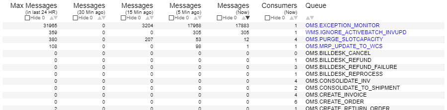

# <span style="color: red;">This tutorial is WIP</span>


# Creating a Table visualization using Vega
This tutorial will walk you through creating a table visualization using Vega. The table would have:
- Banded rows
- Sorting capability on columns
- Filtering capability (hiding zero quantity rows)

*This assumes that the reader has basic understanding of how Vega works.*

**Here is how the visualization looks like:**



[View source](./source/final_source.json)


# Background and the requirement
We have a set of systems that pass on messages through MQ. When a system doesn't behave per expectations, often the system admin would want to kow what is happening with the MQ messages. So, we monitor the MQ every minute, and send the Queue Depth (Number of messages in the queue) and the Number of Consumers on each queue to Elasticsearch. That data is used to build this visualization.

The requirement is:
* To show :
  1. the number of messages in each queue at the following points in time:
    - Now
    - 5 Minutes ago
    - 15 Minutes ago
    - 30 Minutes ago
  2. the maximum number of messages that the queue had in last 24 hours
  3. the number of consumers on each queue
* Be able to sort the data
* Be able to filter out the rows with zero messages
* Highlight the queues that currently have messages

# Data for the tutorial
In the real visualization, data is pulled from Elasticsearch. There are two `datasets` that are pulled from Elasticsearch.

`mqdata-last-30-min-sorted` - This contains the number of messages and number of consumers for each queue at the desired time intervals. This is achived with range query on Elasticsearch.
```json
"query": {
  "bool": {
    "should": [
      {"range": {"SysTime": {"gte": "now-70s",   "lte": "now",       "_name": "Now"}}},
      {"range": {"SysTime": {"gte": "now-370s",  "lte": "now-300s",  "_name": "5MinBack"}}},
      {"range": {"SysTime": {"gte": "now-970s",  "lte": "now-900s",  "_name": "15MinBack"}}},
      {"range": {"SysTime": {"gte": "now-1870s", "lte": "now-1800s", "_name": "30MinBack"}}}
    ]
  }
}
```


`maxdepth-24H` - This contains the maximum of messages for each queue in last 24 hours. This is achived with and aggregation Elasticsearch.
```json
"aggs": {
  "queues": {
    "terms": {"field": "FQQN.keyword", "size": 150},
    "aggs": {
      "MaxDepth": {"max": {"field": "Depth"}}
    }
  }
}
"query": {
  "range": {"SysTime": {"gte": "now-1d/m", "lte": "now/m"}}
}
"size": 0

```


